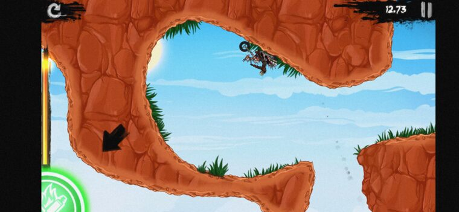
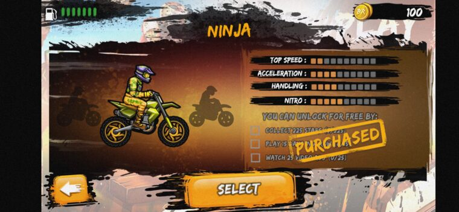
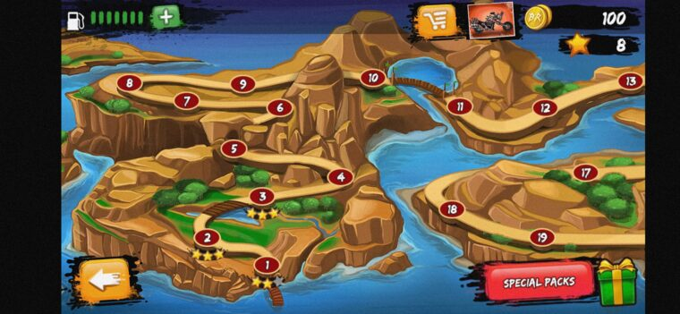
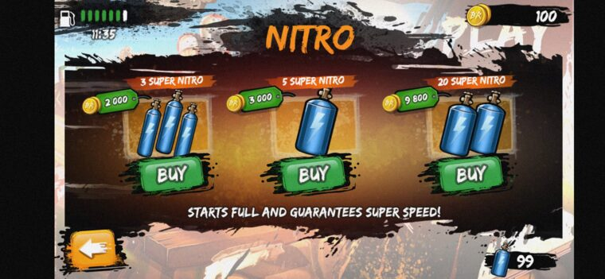

<div align="center">

# 🪦 → 🏍️ &nbsp; R E V E N A N T

### Bringing a *dead* 2014 mobile game back to life on a 2026 phone.

<p>


</p>
<p>


</p>
<p>


</p>



<em>It rides again. Tilt to flip, every bike unlocked, infinite everything — offline, forever.</em>

</div>

---

### 🩺 `patient@morgue ~ chart`

```
                                       Bike Rivals 1.5.2  (com.miniclip.bikerivals)
        ╔══════════════════╗          ──────────────────────────────────────────────
        ║   T O E   T A G  ║          Released   : 2014 · cocos2d-iphone, ported to
        ║                  ║                        Android via Apportable / cocotron
        ║  com.miniclip    ║          Cause of   : online servers shut down → can't
        ║  .bikerivals     ║          "death"       progress past World 1, can't buy
        ║                  ║                        anything, delisted from the stores
        ║  ☠  D.O.A.  ☠   ║          Tilt       : lean-to-flip controls DEAD on
        ║                  ║                        Android 12+ (accelerometer never
        ╚══════════════════╝                        registers)
                                       "Cure" on   : every "MOD APK" online ships a
                                        the street    remote-DEX MALWARE loader (dexapt.com)
                                       Prognosis  : RESURRECTED ✓ — malware-free, all
                                                    content unlocked, controls restored
```

> A 2014 abandonware trials game I actually liked. The servers are gone, so a clean copy is a
> beautiful museum piece you can't play. The "mods" online are malware. So I brought my own back
> from the dead — the right way. *Brain by me, scalpel by an army of AI agents.* 🎻

---

## 🫀 Vital Signs Restored

| Symptom | Diagnosis | Treatment |
|---|---|---|
| 🤸 **Tilt controls dead** | Accelerometer never registers on Android 12+; game never calls `setEnabled(true)` | Force-register the sensor + `HIGH_SAMPLING_RATE_SENSORS` perm + try/catch the native bind race · [`docs/TILT-FIX.md`](docs/TILT-FIX.md) |
| 🌍 **Stuck in World 1** | World/level unlock is server-gated (stars + multiplayer wins) — impossible offline | Patch `isWorldUnlocked:` / `isUniverseUnlocked:` → **YES** |
| 🏍️ **Bikes un-buyable** | Purchase is server-confirmed; the store's owned-check is native Obj-C | Patch the **`unlocked` getter** (the *real* gate — see the war story) → **YES** |
| 🛢️ **Fuel runs out** | Gas tank empties as you play; no refills without the server | Redirect `gasBarsLeft` → `gasBarsTotal`: the tank reads **full, always** |
| 💨 **Nitro / ⛑️ Helmets limited** | Consumable packs you bought with (dead) coins | `consumableCount:` → **99** + `useConsumable:` never spends |
| 🦠 **Every online "mod" is malware** | 3rd-party APK = `eqkqk` remote-DEX loader phoning `dexapt.com` | Built our own from the **clean** original; malware never touched · [`docs/ANALYSIS.md`](docs/ANALYSIS.md) |

<div align="center">

&nbsp;

&nbsp;

</div>

---

## 🔬 The Operation (how it actually works)

Everything is a **surgical binary patch** to the game's 32-bit ARM `libgame.so` — no malware, no
re-distribution of Miniclip's code, just `mov r0, #1` in the right places. The patcher asserts the
original bytes before every cut, so a different `libgame.so` aborts loudly instead of corrupting.

```python
# build/apply_patches.py — 13 patches, each: (name, file-offset, expected-original-bytes, new-bytes)
("isWorldUnlocked:",     0x6b0df0, "f0492de914b08de2", "mov r0,#1; bx lr")    # all worlds
("bike.unlocked",        0x5eea94, "14109fe514209fe5", "mov r0,#1; bx lr")    # THE bike gate
("gasBarsLeft->Total",   0x6b4e24, "14109fe5",         "b gasBarsTotal")      # ∞ fuel
("consumableCount:",     0x6b1cf0, "010052e3...",      "mov r0,#0x63; bx lr") # 99 nitro/helmets
...
```

The four pillars:

1. **🦠 Malware autopsy.** Diffed the original APK against "modded" ones. The native `.so`s were
   byte-identical — the "mod" was *pure dex injection*: a remote class-loader (`eqkqk` /
   `SavesRestoringPortable`) that pulls and runs code from `dexapt.com` at launch. We threw it away
   and patched the **clean** original. [`docs/ANALYSIS.md`](docs/ANALYSIS.md)

2. **🔐 Save cipher, cracked.** The encrypted `data.dat` is `"<len>\0"` + an **8-byte repeating-XOR**
   body + an 8-byte hash trailer. Recovered the key **`[redacted-key]`** with a column-mode attack
   (the plaintext is 46% zero bytes, so the most-common byte per column *is* the key).

3. **🧠 The native gate, via emulation.** The unlock checks are Objective-C on the **Apportable/cocotron**
   (GNUstep) runtime, with **non-fragile ivars** — so static getter patches kept missing. With Frida
   dead on-device and the Android emulator unable to run ARM at all, I loaded `libgame.so` into
   **[unidbg](https://github.com/zhkl0228/unidbg)** (a JVM/Unicorn ARM emulator), recovered the
   `BikeInfo` ivar layout, and proved the store reads `unlocked`@`0xb` — *not* the field I'd been
   patching. One byte later: every bike. [`docs/BIKE-UNLOCK-STATUS.md`](docs/BIKE-UNLOCK-STATUS.md)

4. **🏭 Reproducible build.** `apktool d` → patch smali (tilt) + `libgame.so` (unlocks) → `apktool b`
   → `uber-apk-signer` (v1+v2+v3). One command, deterministic, malware-free.

---

## 📖 The War Story

This was *not* clean. It was a multi-day siege with a brutal final boss (the bikes), where **every
dynamic-analysis tool on the planet refused to cooperate** before a JVM-based ARM emulator finally
cracked it open overnight.

> Frida crashes the 32-bit game. SELinux blocks `/proc/mem`. The modern Android emulator dropped ARM
> *entirely*. x86-translation crashes on a NEON bug. Waydroid needs a kernel module that isn't there.
> Ghidra decompiles to garbage. I patched the **wrong ivar eight times**...

👉 **The full saga — every dead end, the overnight breakthrough, the timeline, and the lessons —
lives in [`docs/JOURNEY.md`](docs/JOURNEY.md).** It's the good part.

---

## ▶️ Run It Yourself

You bring your own **legally-owned** copy of the original `Bike+Rivals_1.5.2.apk` (this repo ships
**zero** Miniclip code — see [Is this legal?](#️-is-this-legal)). Then:

```bash
# deps: apktool, uber-apk-signer, python3, adb, keytool, imagemagick
mkdir -p base && cp /path/to/Bike+Rivals_1.5.2.apk base/

bash build/build.sh                 # decode → patch → rebuild → sign (auto-generates a debug keystore)
adb install -r dist/BikeRivals-1.5.2-*.apk
```

Two outputs land in `dist/`:
- `…-diagnostic-unlock.apk` — the full revival (tilt + worlds + bikes + ∞ fuel/nitro/helmets).
- `…-SAFE-worlds-tilt.apk` — a conservative fallback (tilt + worlds only).

Re-installs preserve your save (same signing key). The emulation harness is in `tools/unidbg/`; the
patcher + tilt smali in `build/`.

---

## 🎓 Lessons from the Operating Table

- **Abandonware isn't "free real estate."** A dead server doesn't kill copyright; it just kills the
  fun. Reviving it cleanly is a research problem, not a piracy one.
- **GNUstep non-fragile ivars defeat naive static patching** — accessor offsets are filled at
  runtime, so the "obvious" getter patch reads a phantom. You have to *run* the runtime.
- **When every emulator/debugger fails, emulate the library, not the device.** `unidbg` runs a single
  `.so` in a JVM — no device, no SELinux, no NEON translator, no Frida injection. It was the whole game.
- **Verify on real hardware.** My first "unlimited fuel" patched the wrong consume path and *looked*
  fine in my test. The user played one level and it dropped. The robust fix fakes "full" at the
  *reporting* layer, immune to every consume path.
- **The boring win beats the clever one.** Redirecting `gasBarsLeft → gasBarsTotal` (one branch
  instruction) is uglier than finding "the" consume function — and far more reliable.

---

## 🔮 What's Next (researched, not yet built)

- **🛠️ Live ImGui mod menu** — inject a 32-bit `.so`, hook `eglSwapBuffers`, draw an ImGui overlay,
  and tweak bike physics (`speedLimit`, `forceScale`, `tilt`, nitro) in real time.
- **🏁 Custom level maker** — levels are **encrypted-JSON spline tracks** (Catmull-Rom → Box2D chains).
  Crack the level cipher, then a PC editor: drag control points, drop objects, re-encrypt with the
  engine's own writer. [`docs/LEVEL-MAKER.md`](docs/LEVEL-MAKER.md)
- **🎨 Bike skins & physics** — already editable in plaintext `<Bike>Pref.plist`. [`docs/MODDING-MAP.md`](docs/MODDING-MAP.md)

---

## ⚖️ Is This Legal?

This repo is deliberately the **defensible path**: it contains **only original work** — analysis,
byte offsets, patch scripts, and build tooling — and **none of Miniclip's APK, assets, or decompiled
game code** (the `.gitignore` enforces this). You bring your own legally-owned copy; nothing here
redistributes the game. Fixing the broken motion controls sits on the strongest footing (closest to a
lawful user's *error-correction* right); the content unlocks are research on a title whose
rights-holder has walked away.

A full, sourced breakdown — Vietnam's IP Law (incl. the **1 Apr 2026** amendment, Law 131/2025/QH15),
the anti-circumvention nuance (Art. 28), the software-specific gaps (no decompilation exception;
software excluded from the study/research copying exception), and a **risk traffic-light per
scenario** — is in **[`docs/LEGAL.md`](docs/LEGAL.md)**. How the modding & preservation community keeps
repos safe (the *patches-not-binaries* norm, the §1201 line, GitHub DMCA mechanics, and the model for a
dedicated preservation org) is in **[`docs/PRESERVATION-PLAYBOOK.md`](docs/PRESERVATION-PLAYBOOK.md)**.

> **Not legal advice.** Keep it personal, use your own copy, and **do not redistribute the patched APK
> or any game assets** — that's the bright line. For a real go/no-go, ask a Vietnamese IP lawyer.

---

## 📜 Disclaimer & License

This project is an independent, **non-commercial** modification for **education, interoperability, and
preservation research**. It is **not affiliated with, authorized by, or endorsed by Miniclip**.
"Bike Rivals" and all related names, logos, and assets are trademarks of their respective owners.

This repository contains **no copyrighted game assets, binaries, or original source** — only original,
independently authored work (the [`.gitignore`](.gitignore) and [`CHECKSUMS`](CHECKSUMS) enforce this).
A **legally obtained copy** of the original game is required to run the build; **this repo cannot be
used to obtain or play the game.**

- **Code** (`build/`, `tools/`) → **GNU GPL v3.0** ([`LICENSE`](LICENSE))
- **Documentation** (`docs/`, `README`) → **CC BY-SA 4.0**
- See [`NOTICE`](NOTICE) for the exact ownership scope.

The license covers only the author's original work — never the game itself, which remains © Miniclip.

---

<div align="center">

### 🧾 Credits

**Reverse engineering & direction:** Tyler ([SvnFrs](https://github.com/SvnFrs)) — *I orchestrate, the agents type.* 🐸
**Execution:** Claude Code (the scalpel).
**Engine archaeology:** Miniclip / Profusion Studios (2014), Apportable, cocotron, GNUstep.
**Crowbar of last resort:** [unidbg](https://github.com/zhkl0228/unidbg).

<sub>From toe-tag to throttle. Built async, remote-first, and slightly over-engineered on purpose. I use Arch, BTW. 🐧</sub>

</div>
